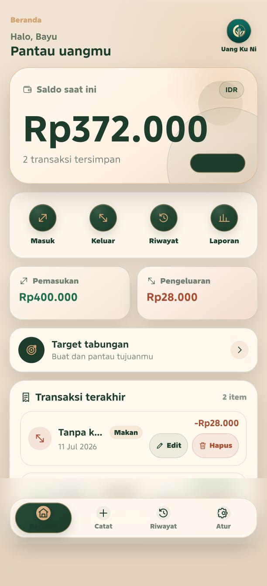
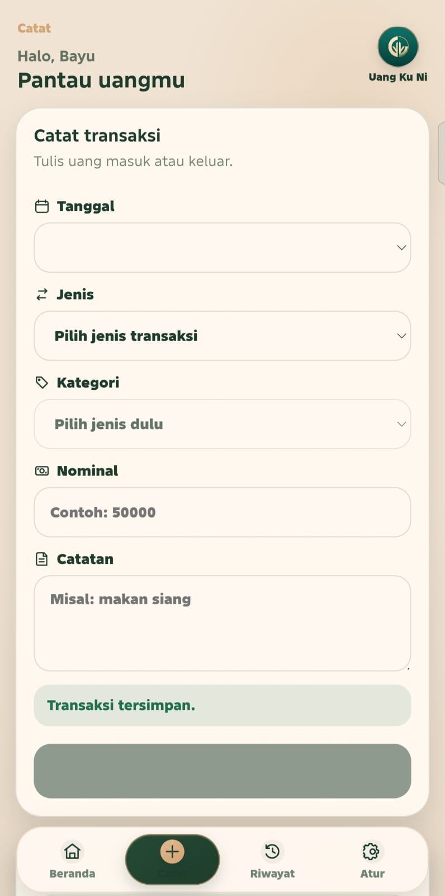
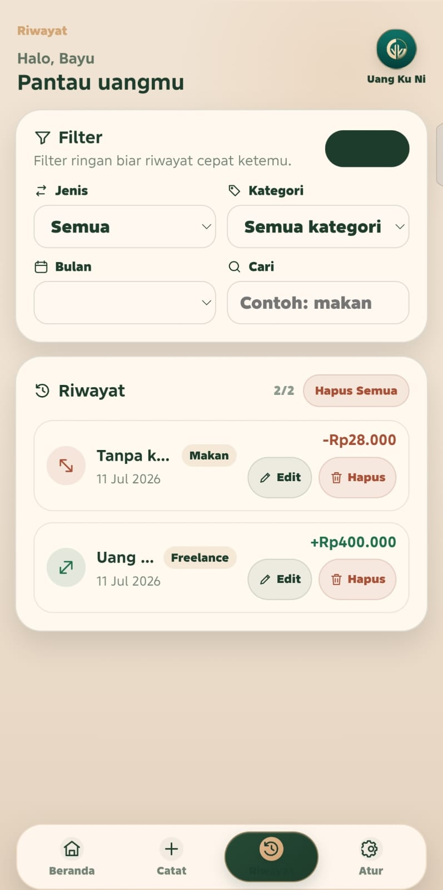
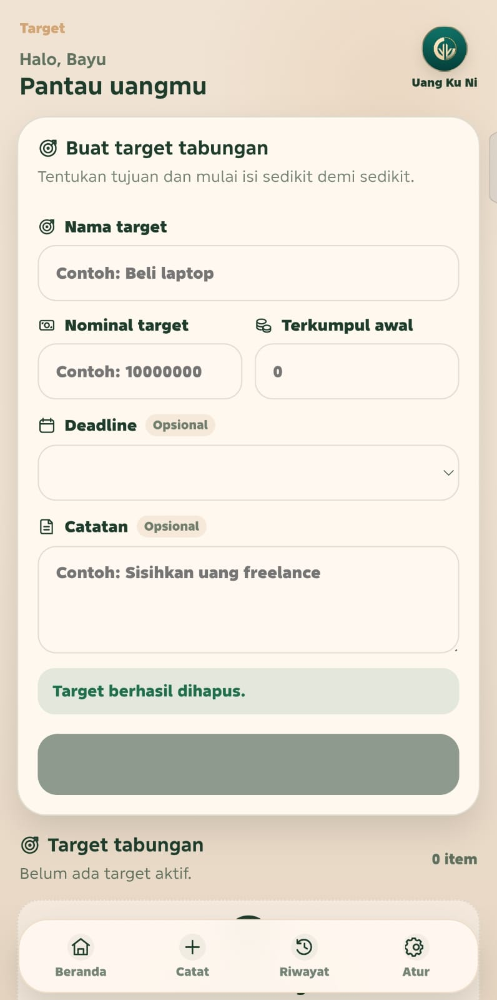
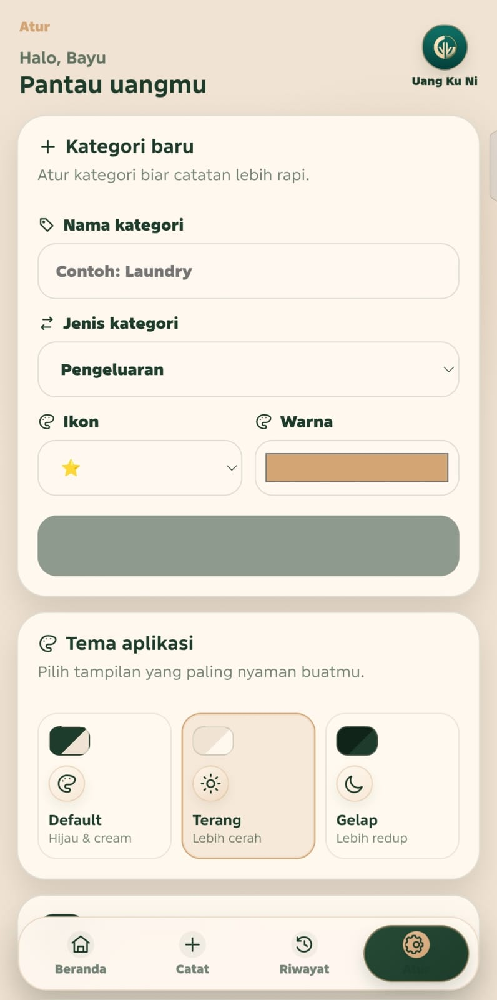
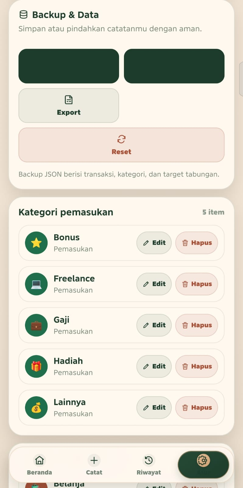

# Uang Ku Ni

Uang Ku Ni adalah aplikasi pencatat keuangan pribadi berbasis web dan PWA yang dirancang dengan pendekatan mobile-first. Aplikasi ini membantu pengguna mencatat dan memahami kondisi keuangan sehari-hari lewat tampilan yang ringkas, nyaman, dan mudah digunakan di HP.

Data disimpan langsung di perangkat melalui `localStorage`, jadi aplikasi belum membutuhkan akun maupun backend.

## Tujuan Project

Project ini dibuat untuk membantu pengguna mencatat pemasukan dan pengeluaran, memantau saldo, melihat laporan bulanan, mengatur kategori, menyusun target tabungan, serta mencadangkan data keuangan secara mandiri.

## Fitur Utama

- Catat pemasukan
- Catat pengeluaran
- Edit dan hapus transaksi
- Ringkasan saldo, pemasukan, dan pengeluaran
- Filter dan pencarian transaksi
- Laporan keuangan bulanan
- Grafik pemasukan dan pengeluaran sederhana
- Kategori transaksi custom
- Target tabungan dan progress dana
- Backup dan restore data dalam format JSON
- Export transaksi ke CSV
- Tema default, terang, dan gelap
- PWA yang dapat dipasang di layar utama HP

## Teknologi

- HTML
- CSS
- React
- TypeScript / JavaScript
- Vite
- `localStorage`
- Web App Manifest (`manifest.json`)
- Service Worker (`service-worker.js`)
- Netlify atau GitHub Pages untuk hosting

## Tampilan Aplikasi

Tampilan Uang Ku Ni dibuat khusus untuk layar HP dengan gaya aplikasi keuangan yang sederhana. Aplikasi tetap bisa dibuka di laptop, dengan lebar konten yang menyerupai layar aplikasi mobile.

| Dashboard | Catat transaksi | Riwayat & filter |
| --- | --- | --- |
|  |  |  |

| Target tabungan | Kategori & tema | Backup data |
| --- | --- | --- |
|  |  |  |

## Demo dan Instalasi

- **Demo GitHub Pages:** [Buka Uang Ku Ni](https://sihombingbayu0-hub.github.io/portofolio-bayu/uang-ku-ni/)
- **Detail portofolio:** [Baca studi kasus project](../project-uang-ku-ni.html)
- **Install PWA:** buka demo melalui Chrome HP, masuk ke menu **Atur**, lalu tekan **Install Aplikasi**. Jika tombol belum muncul, gunakan menu browser **Tambahkan ke layar utama**.

## Alur Penggunaan

1. Catat pemasukan atau pengeluaran dari menu **Catat**.
2. Dashboard memperbarui saldo, pemasukan, dan pengeluaran secara otomatis.
3. Cari transaksi melalui filter jenis, kategori, bulan, atau keterangan.
4. Buka laporan untuk melihat ringkasan bulanan dan perbandingan kategori.
5. Buat target tabungan dan tambahkan dana secara bertahap.
6. Gunakan menu **Atur** untuk kategori custom, tema, backup, restore, dan export CSV.

## Penyimpanan Data

Semua data disimpan lokal di browser menggunakan `localStorage`. Aplikasi tidak mengirim data ke server dan tidak membutuhkan akun. Karena data melekat pada browser dan perangkat, pengguna disarankan membuat backup JSON sebelum membersihkan data browser atau berpindah perangkat.

## Menjalankan di Lokal

Pastikan Node.js dan pnpm sudah tersedia di komputer.

1. Download project atau clone repository:

   ```bash
   git clone URL_REPOSITORY
   ```

2. Masuk ke folder project:

   ```bash
   cd catatan-keuangan-bayu
   ```

3. Install dependency:

   ```bash
   pnpm install
   ```

4. Jalankan server pengembangan:

   ```bash
   pnpm dev
   ```

5. Buka alamat lokal yang ditampilkan Vite, biasanya `http://localhost:5173`.

Karena project memakai Vite, jangan membuka `index.html` secara langsung. Live Server juga tidak diperlukan; gunakan perintah `pnpm dev` agar seluruh modul aplikasi dapat dimuat dengan benar.

## Build Produksi

Buat versi aplikasi yang siap di-hosting dengan perintah:

```bash
pnpm build
```

Hasil build akan tersedia di folder `dist`. Untuk memeriksanya sebelum deploy:

```bash
pnpm preview
```

## Upload ke Netlify

### Melalui Netlify Drop

1. Jalankan `pnpm build`.
2. Buka [Netlify Drop](https://app.netlify.com/drop).
3. Upload atau tarik folder `dist` ke halaman Netlify Drop. Folder tersebut boleh dijadikan ZIP terlebih dahulu jika diperlukan.
4. Tunggu proses deploy selesai.
5. Salin link HTTPS yang diberikan Netlify.
6. Buka link tersebut dari HP.

### Melalui Repository GitHub

1. Upload source project ke GitHub.
2. Di Netlify, pilih **Add new site** lalu hubungkan repository.
3. Isi build command dengan `pnpm build`.
4. Isi publish directory dengan `dist`.
5. Jalankan deploy dan buka link HTTPS yang dihasilkan.

## Install Aplikasi di HP

1. Buka link aplikasi yang sudah di-hosting melalui Chrome di HP.
2. Masuk ke menu **Atur** pada aplikasi.
3. Tekan tombol **Install Aplikasi** jika tersedia.
4. Setujui konfirmasi pemasangan dari browser.
5. Ikon Uang Ku Ni akan muncul di layar utama dan dapat dibuka seperti aplikasi biasa.

Jika tombol instal tidak muncul, buka menu browser lalu pilih **Tambahkan ke layar utama**. Pada iPhone atau iPad, buka aplikasi melalui Safari, tekan **Bagikan**, lalu pilih **Add to Home Screen**.

PWA bekerja paling baik melalui hosting HTTPS seperti Netlify atau GitHub Pages. Membuka file secara langsung dari penyimpanan HP tidak akan mengaktifkan seluruh dukungan PWA.

## Struktur Folder

```text
catatan-keuangan-bayu/
|-- index.html                 # HTML utama aplikasi
|-- package.json               # Dependency dan perintah project
|-- public/
|   |-- manifest.json          # Konfigurasi PWA
|   |-- service-worker.js      # Cache dan dukungan offline dasar
|   |-- icon-192.png           # Icon aplikasi ukuran 192x192
|   `-- icon-512.png           # Icon aplikasi ukuran 512x512
|-- src/
|   |-- components/            # Komponen antarmuka yang dapat digunakan ulang
|   |-- pages/                 # Halaman utama aplikasi
|   |-- styles/global.css      # CSS utama aplikasi
|   |-- utils/                 # Logika transaksi, kategori, tema, dan backup
|   |-- App.tsx                # Struktur dan state utama aplikasi
|   `-- main.tsx               # Titik masuk React
`-- README.md                  # Dokumentasi project
```

Pada project ini, fungsi yang biasanya berada di `script.js` sudah dipisah ke file TypeScript di folder `src`, sedangkan `style.css` menggunakan nama `src/styles/global.css`.

## Rencana Pengembangan

- Login pengguna
- Sinkronisasi data ke cloud
- Database online
- Notifikasi pengingat transaksi dan target tabungan
- Versi APK Android
- Statistik keuangan yang lebih lengkap

## Catatan Portofolio

Uang Ku Ni dibuat sebagai latihan sekaligus project portofolio pengembangan aplikasi mobile-first berbasis PWA. Project ini menjadi tempat untuk mempraktikkan pengelolaan state, penyimpanan lokal, visualisasi data sederhana, desain responsif, dan pengalaman instalasi aplikasi web di HP.
