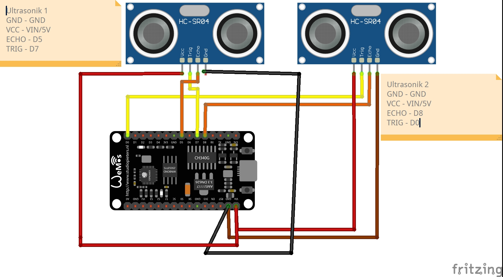
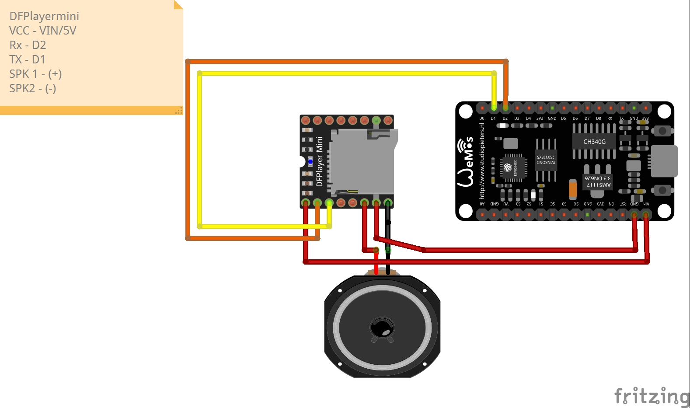
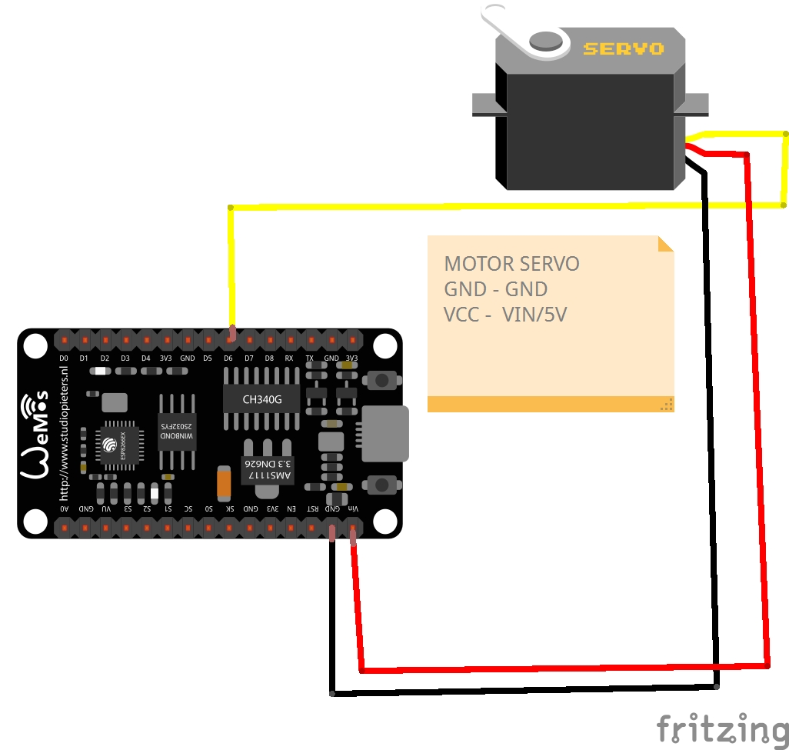
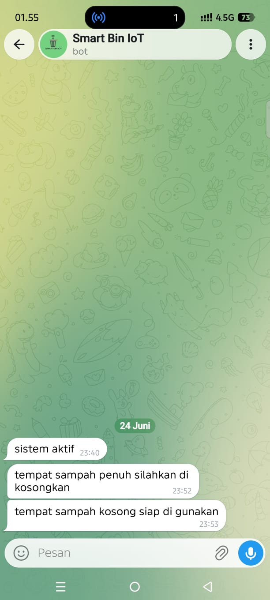
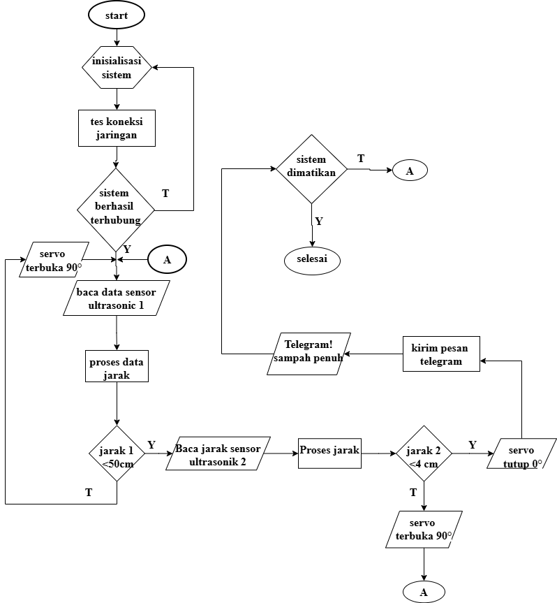
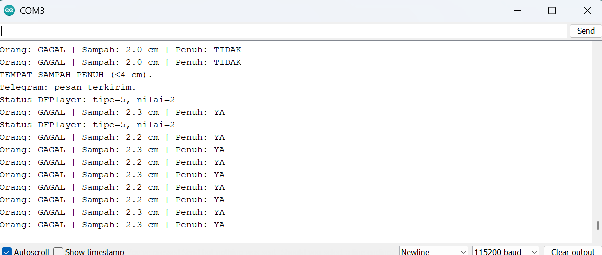
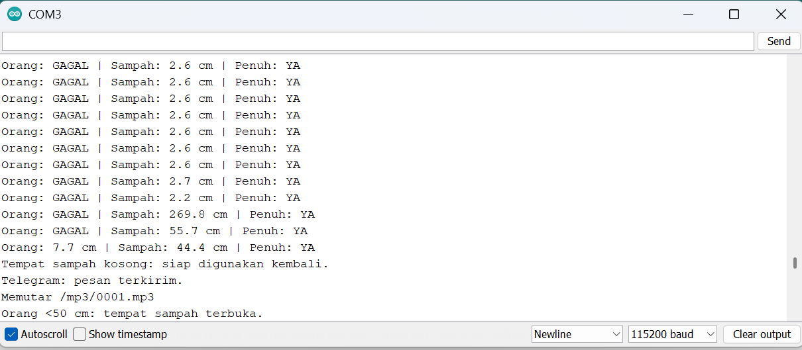

# Tempat Sampah IoT NodeMCU ESP8266

## Fungsi

- Ultrasonik 1 membuka tutup saat orang berjarak kurang dari 50 cm.
- DFPlayer memutar suara 1 saat orang datang, suara 2 setelah selesai, dan suara 3 saat penuh.
- Ultrasonik 2 menyatakan penuh jika jarak sampah sekitar 4 cm.
- Saat tempat sampah penuh, tutup tidak terbuka otomatis ketika orang datang.
- ESP8266 mengirim data sensor ke Firebase Realtime Database pada path `smartbin`.
- Aplikasi HP dapat mengubah `smartbin/tutupTerbuka` untuk membuka atau menutup servo.
- Saat tempat sampah penuh, tutup tetap bisa dibuka oleh petugas lewat aplikasi HP.
- Aplikasi HP juga mengirim perintah servo lewat `smartbin/perintahTutup` agar perintah tidak tertimpa data sensor.
- Aplikasi HP dapat mengubah `smartbin/perintahSuara` menjadi `1`, `2`, atau `3` untuk memutar DFPlayer Mini.
- Aplikasi HP membaca data Firebase secara realtime untuk menampilkan status tempat sampah.
- Sistem lokal tetap bekerja saat internet mati, lalu data dikirim lagi ketika Wi-Fi kembali tersambung.

## Foto Prototype

| Tampak depan terbuka | Tampak belakang rangkaian |
|---|---|
|  |  |

| Sensor pada tutup | Tampak depan tertutup |
|---|---|
|  |  |

| Rangkaian servo |
|---|
|  |

## Wiring

| Perangkat | Pin perangkat | NodeMCU ESP8266 |
|---|---|---|
| Ultrasonik 1 | TRIG | D7 |
| Ultrasonik 1 | ECHO | D5 melalui pembagi tegangan |
| Ultrasonik 2 | TRIG | D0 |
| Ultrasonik 2 | ECHO | D8 melalui pembagi tegangan |
| Servo | Signal | D6 |
| DFPlayer Mini | TX | D2 |
| DFPlayer Mini | RX | D1 melalui resistor 1 kOhm |

Kabel serial disilang: TX DFPlayer menuju D2 (RX ESP8266), sedangkan RX DFPlayer menerima dari D1 (TX ESP8266).

> D8/GPIO15 adalah pin boot dan harus LOW saat ESP8266 menyala. Jika board gagal boot atau gagal di-upload, lepaskan sementara kabel ECHO ultrasonik 2 dari D8. Pasang kembali setelah upload, lalu restart.

Kedua pin ECHO HC-SR04 menghasilkan 5 V. Gunakan pembagi tegangan, misalnya 1 kOhm dan 2 kOhm, agar sinyal menjadi sekitar 3,3 V.

Kalibrasi kapasitas sampah pada sketch memakai jarak kosong 16 cm dan jarak penuh 4 cm. Jika ukuran tempat sampah berubah, sesuaikan `JARAK_SAMPAH_KOSONG_CM` dan `BATAS_PENUH_CM`.

## Adaptor 5 V

- Positif adaptor 5 V menuju VCC servo, VCC DFPlayer, dan VCC kedua HC-SR04.
- Negatif adaptor menuju GND servo, DFPlayer, HC-SR04, dan GND ESP8266. Semua GND wajib disatukan.
- ESP8266 dapat diberi daya dari adaptor 5 V melalui pin `VIN`/`VU` yang sesuai dengan board, atau melalui kabel USB 5 V. Jangan memasukkan 5 V ke pin `3V3`.
- Gunakan adaptor minimal 5 V 2 A agar tegangan tidak turun saat servo bergerak dan DFPlayer berbunyi.
- Tambahkan kapasitor elektrolit 470-1000 uF di jalur 5 V dekat servo untuk membantu mencegah ESP8266 restart saat servo mulai bergerak.

Servo bergerak perlahan dari 165 derajat saat tertutup ke 75 derajat saat terbuka. Jika ingin lebih lambat, naikkan nilai `JEDA_SERVO_PER_DERAJAT_MS` pada sketch. Jika arah mekaniknya terbalik, tukar nilai `SUDUT_TUTUP` dan `SUDUT_BUKA`.

## File suara

Format microSD sebagai FAT32 dan buat folder `mp3`:

```text
/mp3/0001.mp3  -> suara saat ada orang
/mp3/0002.mp3  -> suara saat selesai membuang
/mp3/0003.mp3  -> suara saat penuh
```

Jika audio lebih panjang dari 3,5 detik, naikkan `JEDA_SUARA_MS` pada sketch.

Saat ESP8266 menyala, sketch akan mencoba tes `0001.mp3` jika `TES_SUARA_SAAT_NYALA` bernilai `true`. Jika Serial Monitor menampilkan `DFPlayer siap` dan `DFPlayer: memutar /mp3/0001.mp3` tetapi speaker tetap diam, periksa speaker, volume, microSD FAT32, nama folder `mp3`, dan nama file `0001.mp3`. Jika Serial Monitor menampilkan `DFPlayer tidak terdeteksi`, periksa ulang kabel TX/RX, VCC 5 V, dan GND bersama.

## Library Arduino IDE

Pilih board `NodeMCU 1.0 (ESP-12E Module)`, kemudian instal:

- `ArduinoJson`
- `DFRobotDFPlayerMini`

Library `ESP8266WiFi`, `ESP8266HTTPClient`, `Servo`, dan `SoftwareSerial` tersedia bersama paket board ESP8266.

Isi data Wi-Fi dan Firebase langsung di bagian atas file `iot_tempat_sampah/iot_tempat_sampah.ino`, lalu upload ke ESP8266. Serial Monitor menggunakan 115200 baud.

## Firebase Realtime Database

Gunakan struktur data berikut:

```json
{
  "smartbin": {
    "kapasitas": 0,
    "jarakOrang": 35,
    "jarakSampah": 16,
    "statusSampah": "Kosong",
    "tutupTerbuka": false,
    "perintahTutup": null,
    "suaraAktif": true,
    "perintahSuara": 0,
    "statusSuara": "Siap"
  }
}
```

Path yang dikirim ESP8266:

- `smartbin/kapasitas`
- `smartbin/jarakOrang`
- `smartbin/jarakSampah`
- `smartbin/statusSampah`
- `smartbin/tutupTerbuka`
- `smartbin/suaraAktif`
- `smartbin/statusSuara`

Path yang dibaca ESP8266 dari aplikasi HP:

- `smartbin/tutupTerbuka`
- `smartbin/perintahTutup`
- `smartbin/suaraAktif`
- `smartbin/perintahSuara`

Untuk uji coba awal, rules Realtime Database dapat dibuat terbuka sementara:

```json
{
  "rules": {
    ".read": true,
    ".write": true
  }
}
```

Setelah proyek berjalan, rules harus diamankan kembali.

## Dokumentasi Rangkaian dan Demonstrasi

Seluruh aset pendukung proyek disatukan pada folder [`assets/dokumentasi-smart-bin`](assets/dokumentasi-smart-bin). Berikut penjelasan setiap gambar dan video.

### 1. Wiring dua sensor ultrasonik



Gambar ini memperlihatkan dua HC-SR04 yang dipakai dengan fungsi berbeda. Ultrasonik 1 membaca keberadaan pengguna di depan tempat sampah melalui TRIG D7 dan ECHO D5. Ultrasonik 2 mengukur jarak permukaan sampah untuk menentukan kondisi penuh melalui TRIG D0 dan ECHO D8. Keduanya berbagi VCC 5 V serta GND dengan NodeMCU.

### 2. DFPlayer Mini dan speaker



Gambar ini menunjukkan sambungan DFPlayer Mini sebagai keluaran audio. Jalur serial dihubungkan silang: TX DFPlayer menuju D2 NodeMCU dan RX DFPlayer menerima sinyal dari D1 melalui resistor 1 kOhm. Speaker terhubung ke SPK1 dan SPK2 agar sistem dapat memutar suara saat pengguna terdeteksi, setelah pembuangan selesai, dan ketika tempat sampah penuh.

### 3. Motor servo pembuka tutup



Gambar ini menjelaskan servo sebagai aktuator tutup. Kabel sinyal servo terhubung ke D6, sedangkan VCC 5 V dan GND memakai catu daya bersama. Servo bergerak dari posisi tutup ke posisi buka saat sensor pertama mendeteksi objek pada jarak yang ditentukan.

### 4. Notifikasi Telegram



Tangkapan layar ini membuktikan integrasi bot Telegram. Sistem mengirim pesan ketika perangkat aktif, ketika kapasitas tempat sampah penuh dan perlu dikosongkan, serta ketika tempat sampah kembali kosong dan siap digunakan.

### 5. Flowchart sistem



Flowchart ini menggambarkan alur program: sistem melakukan inisialisasi dan mengecek jaringan, membaca sensor ultrasonik pertama untuk membuka atau menutup servo, lalu membaca sensor kedua untuk mendeteksi kondisi penuh. Saat penuh, servo ditutup dan Telegram mengirimkan notifikasi.

### 6. Video demonstrasi

[▶ Tonton video demonstrasi Smart Bin (MP4, 9 MB)](assets/dokumentasi-smart-bin/demo-smart-bin.mp4)

Video ini mendokumentasikan demonstrasi prototype Smart Bin sebagai pelengkap diagram rangkaian dan flowchart. Video dapat dibuka dari folder dokumentasi setelah repository dibuka di GitHub.

### 7. Pengujian kondisi sampah penuh



Tangkapan layar Serial Monitor ini menunjukkan sensor ultrasonik 2 membaca jarak sampah sekitar 2,0–2,3 cm. Karena jarak tersebut berada di bawah batas penuh 4 cm secara berulang, sistem menetapkan status `Penuh: YA`, menampilkan pesan `TEMPAT SAMPAH PENUH`, mengirim notifikasi Telegram, dan mencatat respons DFPlayer.

### 8. Pengujian setelah sampah dikosongkan



Tangkapan layar ini menunjukkan proses pemulihan setelah isi tempat sampah diangkat. Pembacaan sensor ultrasonik 2 berubah dari jarak dekat menjadi 269,8 cm, 55,7 cm, dan 44,4 cm; setelah beberapa pembacaan melebihi batas reset, sistem menampilkan pesan `Tempat sampah kosong: siap digunakan kembali.` dan mengirim Telegram. Baris berikutnya memperlihatkan sensor ultrasonik 1 mendeteksi objek pada 7,7 cm, sehingga suara `0001.mp3` diputar dan servo membuka tutup.
