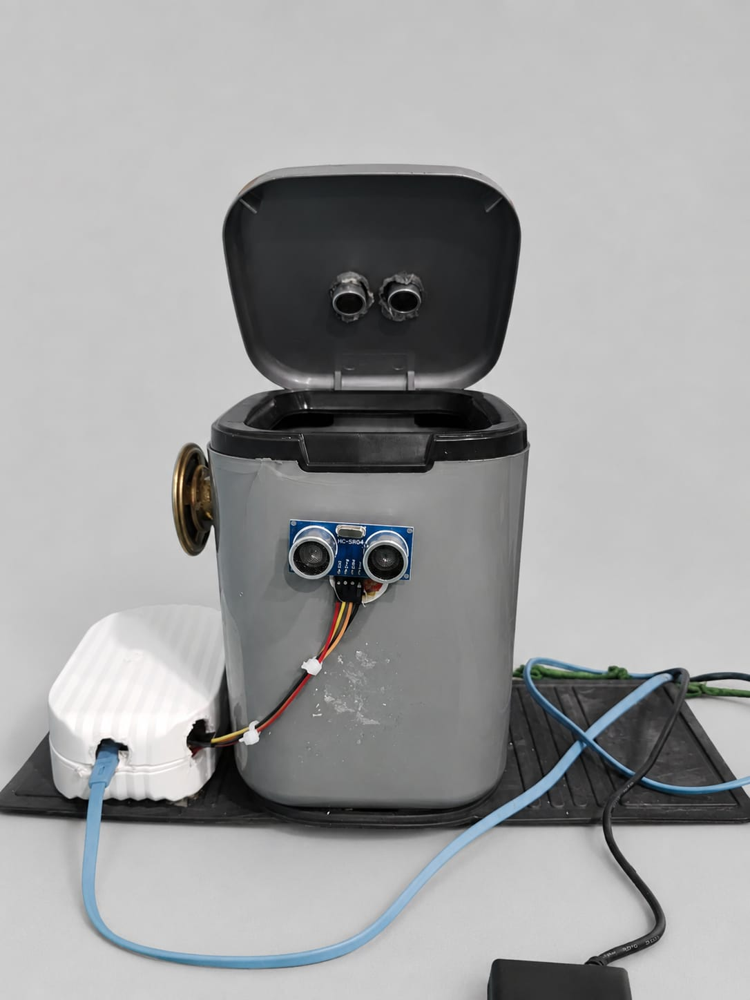
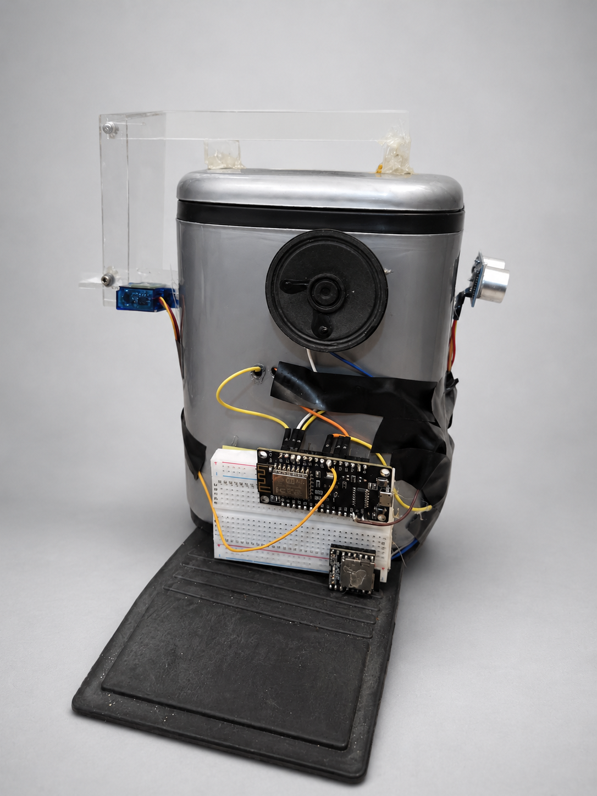
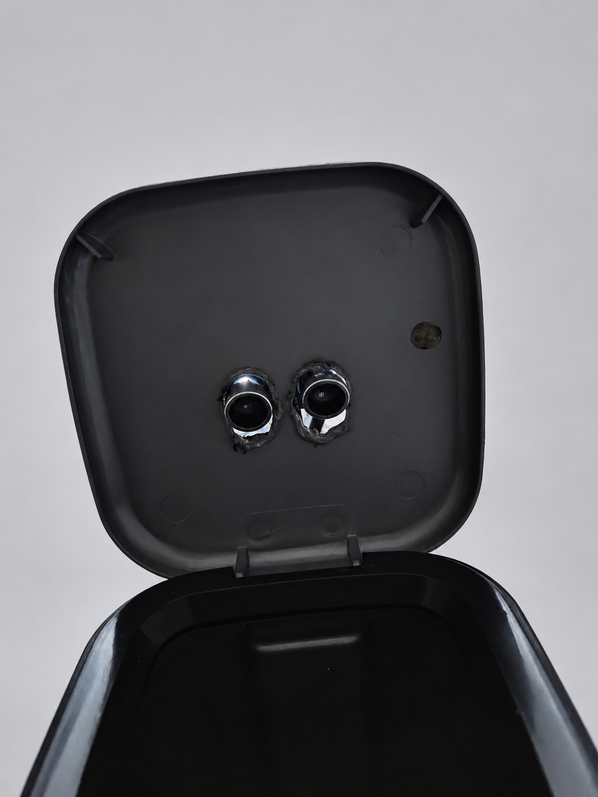
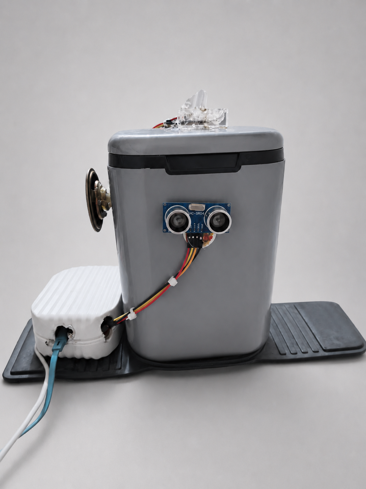
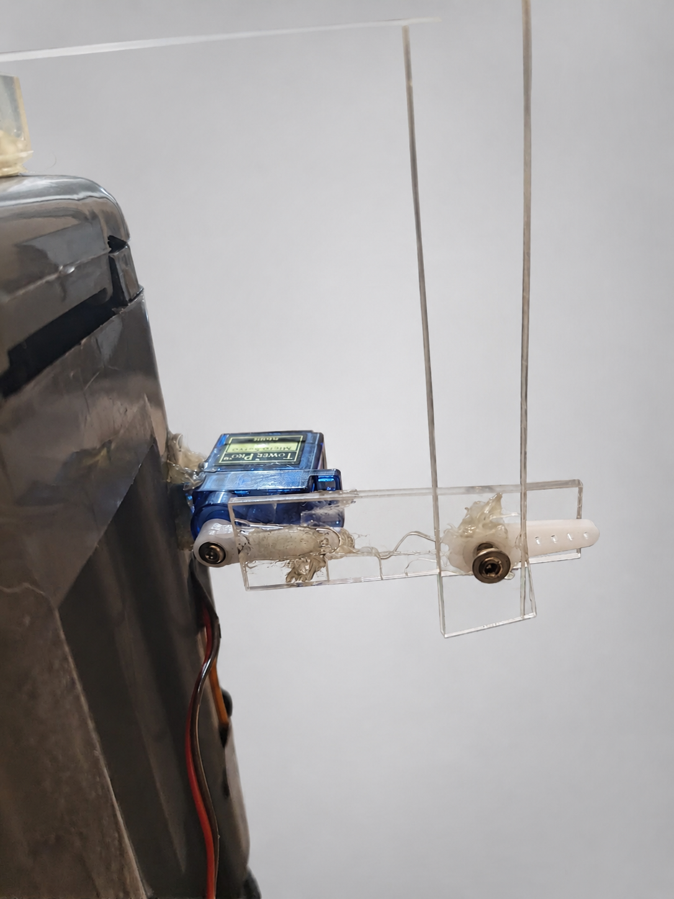

# Tempat Sampah IoT NodeMCU ESP8266

## Fungsi

- Ultrasonik 1 membuka tutup saat orang berjarak kurang dari 50 cm.
- DFPlayer memutar suara 1 saat orang datang, suara 2 setelah selesai, dan suara 3 saat penuh.
- Ultrasonik 2 menyatakan penuh jika jarak sampah kurang dari 10 cm.
- ESP8266 mengirim data sensor ke Firebase Realtime Database pada path `smartbin`.
- Aplikasi HP dapat mengubah `smartbin/tutupTerbuka` untuk membuka atau menutup servo.
- Aplikasi HP juga mengirim perintah servo lewat `smartbin/perintahTutup` agar perintah tidak tertimpa data sensor.
- Aplikasi HP dapat mengubah `smartbin/perintahSuara` menjadi `1`, `2`, atau `3` untuk memutar DFPlayer Mini.
- Aplikasi HP membaca data Firebase secara realtime untuk menampilkan status tempat sampah.
- Sistem lokal tetap bekerja saat internet mati, lalu data dikirim lagi ketika Wi-Fi kembali tersambung.

## Foto Prototype

| Tampak depan terbuka | Tampak belakang rangkaian |
|---|---|
|  |  |

| Sensor pada tutup | Tampak depan tertutup |
|---|---|
|  |  |

| Rangkaian servo |
|---|
|  |

## Wiring

| Perangkat | Pin perangkat | NodeMCU ESP8266 |
|---|---|---|
| Ultrasonik 1 | TRIG | D1 |
| Ultrasonik 1 | ECHO | D2 melalui pembagi tegangan |
| Ultrasonik 2 | TRIG | D7 |
| Ultrasonik 2 | ECHO | D5 melalui pembagi tegangan |
| Servo | Signal | D6 |
| DFPlayer Mini | TX | D4 |
| DFPlayer Mini | RX | D3 melalui resistor 1 kOhm |

Kabel serial disilang: TX DFPlayer menuju D4 (RX ESP8266), sedangkan RX DFPlayer menerima dari D3 (TX ESP8266).

> D3/GPIO0 dan D4/GPIO2 adalah pin boot. Jika board gagal boot atau gagal di-upload, lepaskan sementara kabel DFPlayer dari D3 dan D4. Pasang kembali setelah upload, lalu restart.

Kedua pin ECHO HC-SR04 menghasilkan 5 V. Gunakan pembagi tegangan, misalnya 1 kOhm dan 2 kOhm, agar sinyal menjadi sekitar 3,3 V.

## Adaptor 5 V

- Positif adaptor 5 V menuju VCC servo, VCC DFPlayer, dan VCC kedua HC-SR04.
- Negatif adaptor menuju GND servo, DFPlayer, HC-SR04, dan GND ESP8266. Semua GND wajib disatukan.
- ESP8266 dapat diberi daya dari adaptor 5 V melalui pin `VIN`/`VU` yang sesuai dengan board, atau melalui kabel USB 5 V. Jangan memasukkan 5 V ke pin `3V3`.
- Gunakan adaptor minimal 5 V 2 A agar tegangan tidak turun saat servo bergerak dan DFPlayer berbunyi.
- Tambahkan kapasitor elektrolit 470-1000 uF di jalur 5 V dekat servo untuk membantu mencegah ESP8266 restart saat servo mulai bergerak.

Servo bergerak dari 10 derajat saat tertutup ke 60 derajat saat terbuka. Jika arah mekaniknya terbalik, tukar nilai `SUDUT_TUTUP` dan `SUDUT_BUKA` pada sketch.

## File suara

Format microSD sebagai FAT32 dan buat folder `mp3`:

```text
/mp3/0001.mp3  -> suara saat ada orang
/mp3/0002.mp3  -> suara saat selesai membuang
/mp3/0003.mp3  -> suara saat penuh
```

Jika audio lebih panjang dari 3,5 detik, naikkan `JEDA_SUARA_MS` pada sketch.

## Library Arduino IDE

Pilih board `NodeMCU 1.0 (ESP-12E Module)`, kemudian instal:

- `ArduinoJson`
- `DFRobotDFPlayerMini`

Library `ESP8266WiFi`, `ESP8266HTTPClient`, `Servo`, dan `SoftwareSerial` tersedia bersama paket board ESP8266.

Isi data Wi-Fi dan Firebase langsung di bagian atas file `iot_tempat_sampah/iot_tempat_sampah.ino`, lalu upload ke ESP8266. Serial Monitor menggunakan 115200 baud.

## Firebase Realtime Database

Gunakan struktur data berikut:

```json
{
  "smartbin": {
    "kapasitas": 65,
    "jarakOrang": 35,
    "statusSampah": "Sedang",
    "tutupTerbuka": false,
    "perintahTutup": null,
    "suaraAktif": true,
    "perintahSuara": 0,
    "statusSuara": "Siap"
  }
}
```

Path yang dikirim ESP8266:

- `smartbin/kapasitas`
- `smartbin/jarakOrang`
- `smartbin/statusSampah`
- `smartbin/tutupTerbuka`
- `smartbin/suaraAktif`
- `smartbin/statusSuara`

Path yang dibaca ESP8266 dari aplikasi HP:

- `smartbin/tutupTerbuka`
- `smartbin/perintahTutup`
- `smartbin/suaraAktif`
- `smartbin/perintahSuara`

Untuk uji coba awal, rules Realtime Database dapat dibuat terbuka sementara:

```json
{
  "rules": {
    ".read": true,
    ".write": true
  }
}
```

Setelah proyek berjalan, rules harus diamankan kembali.
